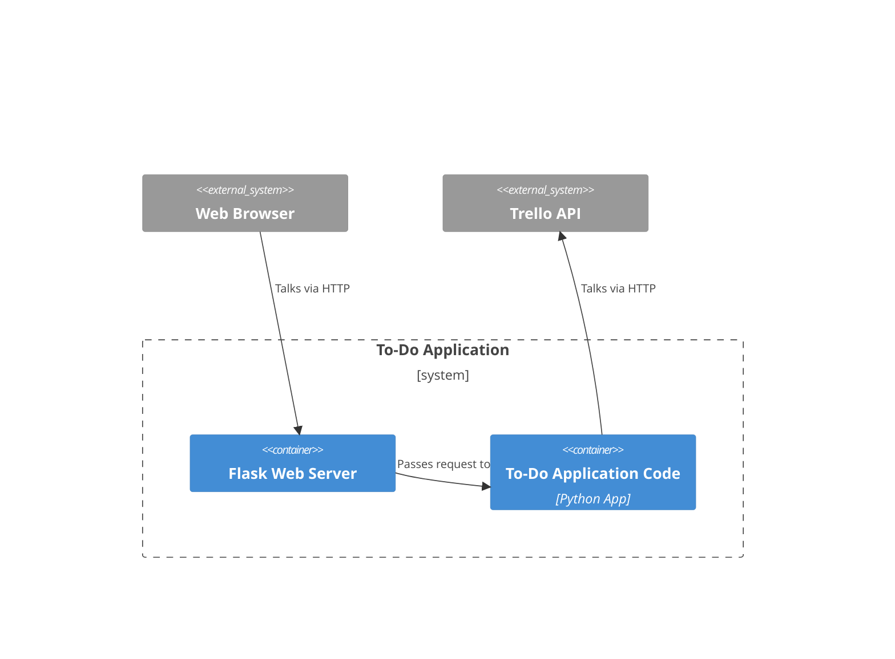

```mermaid
C4Container
    System_Ext(browser, "Web Browser")

    Boundary(todoApp, "To-Do Application") {
        Container(flask, "Flask Web Server")
        Container(todoAppCode, "To-Do Application Code", "Python App")
    }

    System_Ext(trelloApi, "Trello API")

    Rel(browser, flask, "Talks via HTTP")
    Rel(flask, todoAppCode, "Passes request to")
    Rel(todoAppCode, trelloApi, "Talks via HTTP")

    UpdateRelStyle(browser, flask, $offsetX="-5", $offsetY="-50")
    UpdateRelStyle(flask, todoAppCode, $offsetX="-48", $offsetY="-20")
    UpdateRelStyle(todoAppCode, trelloApi, $offsetX="0", $offsetY="-50")
```