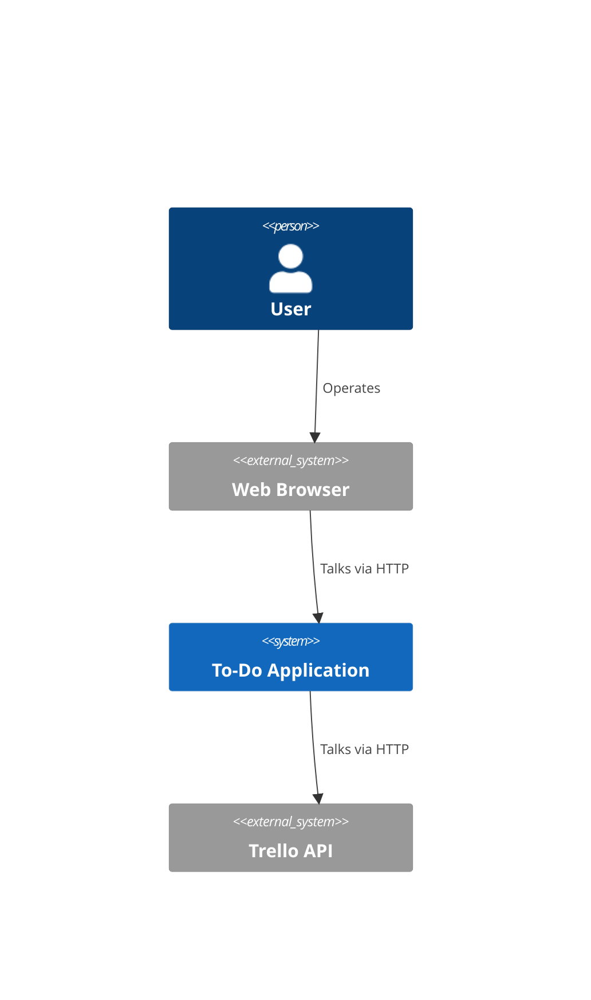

```mermaid
C4Context
    Person(user, "User")
    System_Ext(browser, "Web Browser")
    System(todoApp, "To-Do Application")
    System_Ext(trelloApi, "Trello API")

    Rel(user, browser, "Operates")
    Rel(browser, todoApp, "Talks via HTTP")
    Rel(todoApp, trelloApi, "Talks via HTTP")

    UpdateLayoutConfig($c4ShapeInRow="1")
    UpdateRelStyle(user, browser, $offsetX="5", $offsetY="0")
    UpdateRelStyle(browser, todoApp, $offsetX="5", $offsetY="0")
    UpdateRelStyle(todoApp, trelloApi, $offsetX="5", $offsetY="0")
```