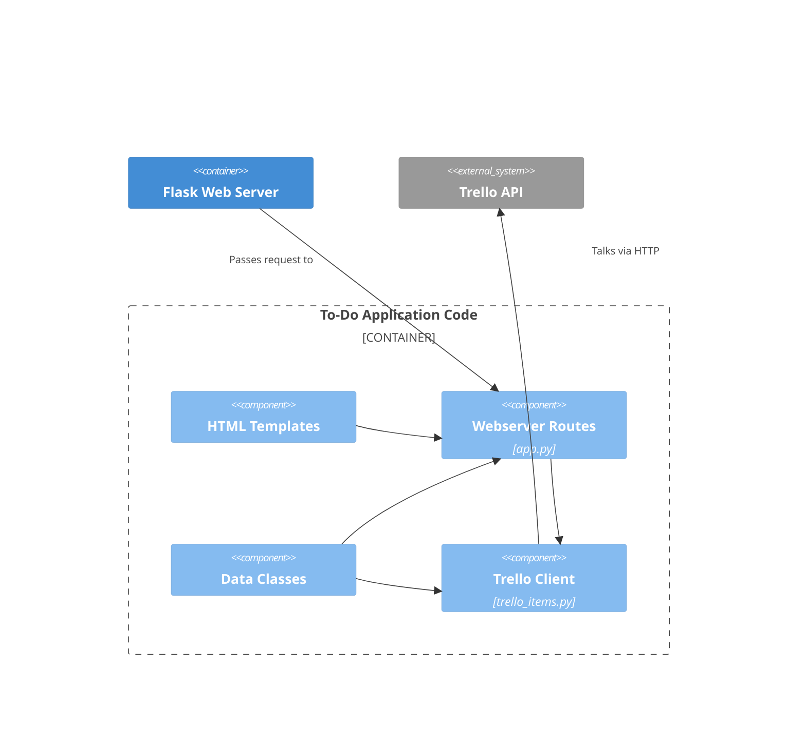

```mermaid
C4Component
    Container(flask, "Flask Web Server")

    Container_Boundary(todoAppCode, "To-Do Application Code") {
        Component(htmlTemplates, "HTML Templates")
        Component(routes, "Webserver Routes", "app.py")
        Component(dataClasses, "Data Classes")
        Component(trelloClient, "Trello Client", "trello_items.py")
    }

    System_Ext(trelloApi, "Trello API")

    Rel(flask, routes, "Passes request to")

    Rel(htmlTemplates, routes, "")
    Rel(dataClasses, routes, "")
    Rel(dataClasses, trelloClient, "")
    Rel(routes, trelloClient, "")

    Rel(trelloClient, trelloApi, "Talks via HTTP")

    UpdateLayoutConfig($c4ShapeInRow="3")
    UpdateRelStyle(flask, routes, $offsetX="-175", $offsetY="-50")
    UpdateRelStyle(trelloClient, trelloApi, $offsetX="85", $offsetY="-150")
```